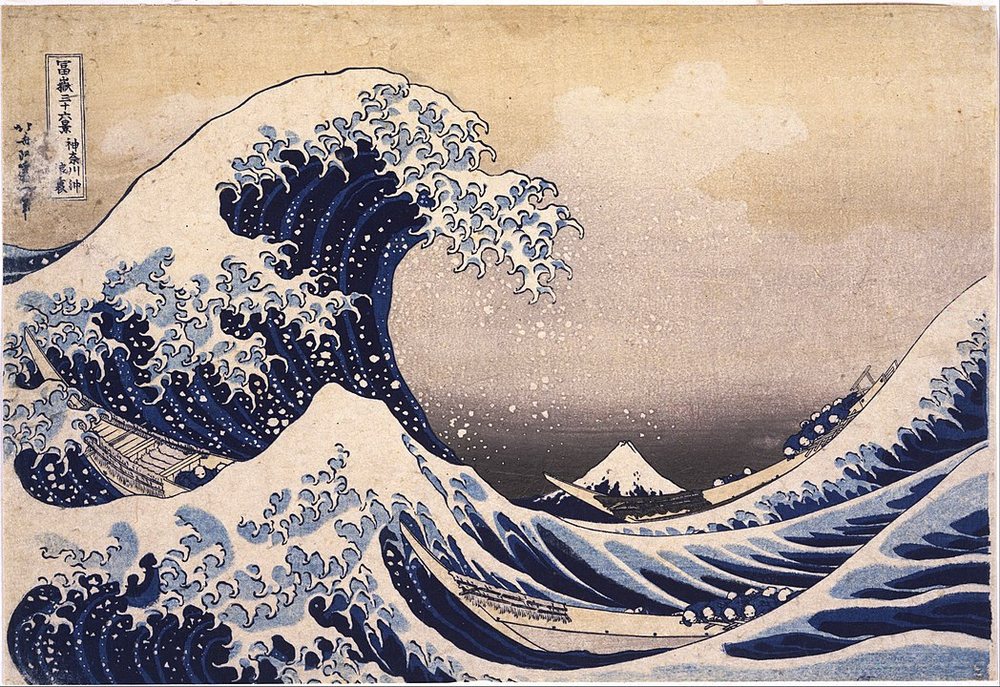

# La grande vague de Kanagawa

Le peintre Hokusai a peint cette estampe en 1830 ou 1831 pendant la
Période *Edo* Cette oeuvre est la plus connue du peintre. La couleur qui
y domine est le bleu de Prusse

# signification de cette estampe

Il s'agit d'une **scène réaliste** mais avec un **aspect dramatique**.
La signification de l'image varie d'ailleurs selon qu'on est occidental
(sans de lecture : gauche à droite) ou japonais (sens de lecture
vertical puis de droite à gauche)

Pour un occidental, les barques se dirigent vers la droite et tentent de
fuir la vague Pour un japonais, les barques dont les rameurs rament à
contre-courant se précipitent vers le creux de la vague.
